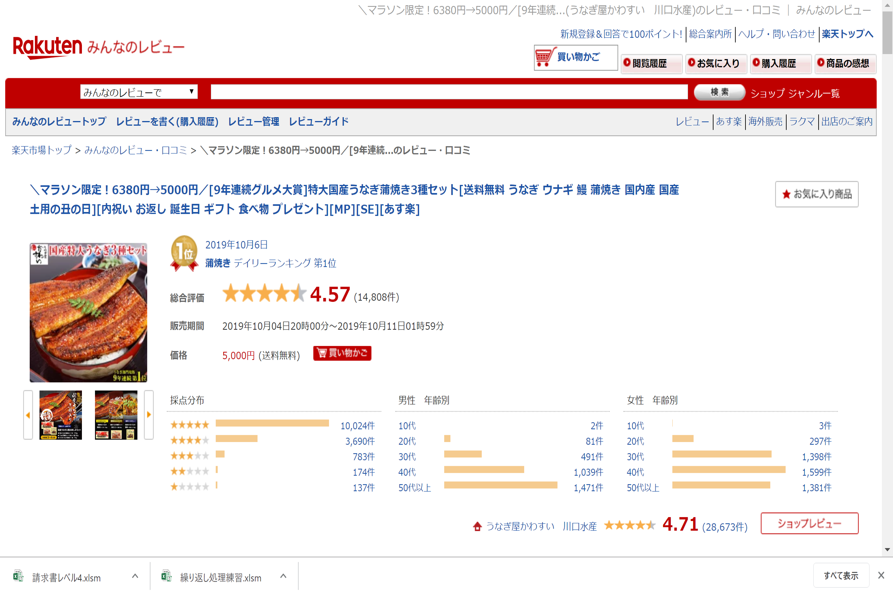
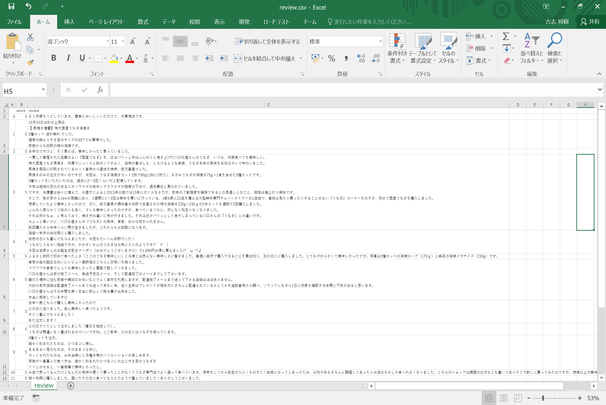
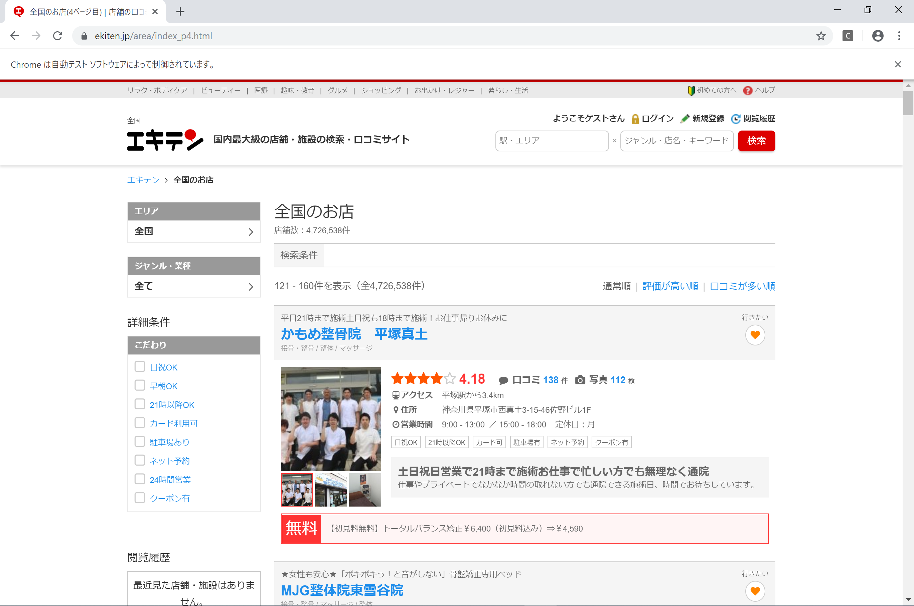
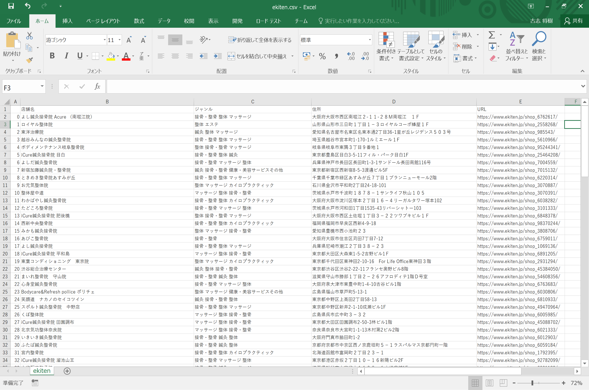

# scraping TIL
## Overview
勉強して書いたスクレイピングに関するコードを挙げているコードです．  
This is a code I learned about scraping.  

## Twitter  
This follows accounts and likes to tweets about TWICE(Korean idole group) on twitter   
  
  
ref:https://www.kpopmonster.jp/?p=27134

## rakuten
This code can do web scraping to reviews of EC site(rakuten)  
  
  
URL: https://review.rakuten.co.jp/item/1/206971_10000130/1.1/  

### output
Score and text of reviews are got.  
  
  

## mercari
For uploading and cancellation on time you decided 

## instagram
For follow, unfollow and likes on instagram

## ekiten
For web scraping in EC site(ekiten)  
### input  
  
website:https://www.ekiten.jp/area/  

### output
Store name,Genre,Adress and URL are got.  
  
  

## login
login processing to instagram by gas and get my hompage.

## selenium-wire
this is for access to http header with selenium-like library(seleniumwire)  
selenium have no ability to access http header.  
selenium-wire is a library to modify it.  
this code can modify the referer.

【reference】  
https://stackoverflow.com/questions/15645093/setting-request-headers-in-selenium  
https://github.com/wkeeling/selenium-wire/issues/6  
https://github.com/wkeeling/selenium-wire/issues/7  

